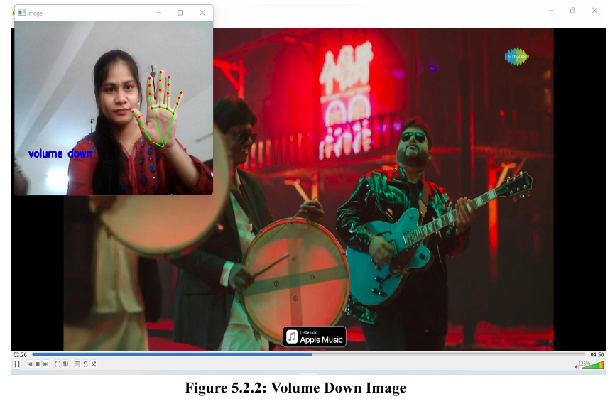
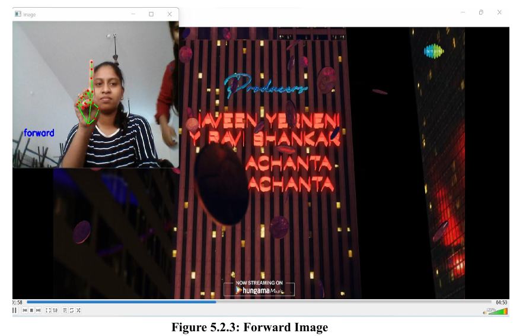
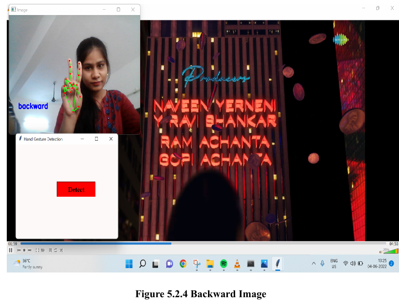

# Gesture-Based Input System

This project implements a gesture-controlled interface that allows users to control applications such as media players using **hand gestures** captured via webcam.  
It leverages **OpenCV** for image processing, **Mediapipe** for hand tracking, and **PyAutoGUI** for simulating keyboard operations.  
A simple **Tkinter GUI** is provided to launch gesture detection.

---

## Features
- Detects hand gestures in real-time via webcam.
- Supports basic media player controls:
  - Forward
  - Backward
  - Volume Up / Down
- Simple GUI built with Tkinter for usability.
- Works with VLC Media Player and other compatible applications.

---

## Tech Stack
- **Programming Language:** Python  
- **Libraries:** OpenCV, Mediapipe, PyAutoGUI, Tkinter  

---

## How to Run

1. Clone this repository:
   ```bash
   git clone https://github.com/qfath001/Gesture-Based-Input-System.git
   cd Gesture-Based-Input-System
   ```

2. Install dependencies:
   ```bash
   pip install -r requirements.txt
   ```

3. Run the application:
   ```bash
   python gesture_input_system.py
   ```

---

## Sample Results

### Forward Gesture


### Backward Gesture


### Volume Down Gesture


---

## Repository Structure
```
├── gesture_input_system.py                  # Main Python code
├── docs/
│   ├── Gesture_Based_Input_System_Report.pdf   # Full project report
│   └── requirements.txt                        # Project dependencies
├── images/                                  # Screenshots of gestures
│   ├── Gesture_1.png
│   ├── Gesture_2.png
│   ├── Gesture_3.png
└── README.md

```
---


## Reports
- [Project Report (PDF)](docs/Gesture_based_input_system.pdf)

---

##  Author
**Reema Mahabooba**  
- [LinkedIn](https://www.linkedin.com/in/reema-mahabooba/)  
- [GitHub](https://github.com/rmaha007)
